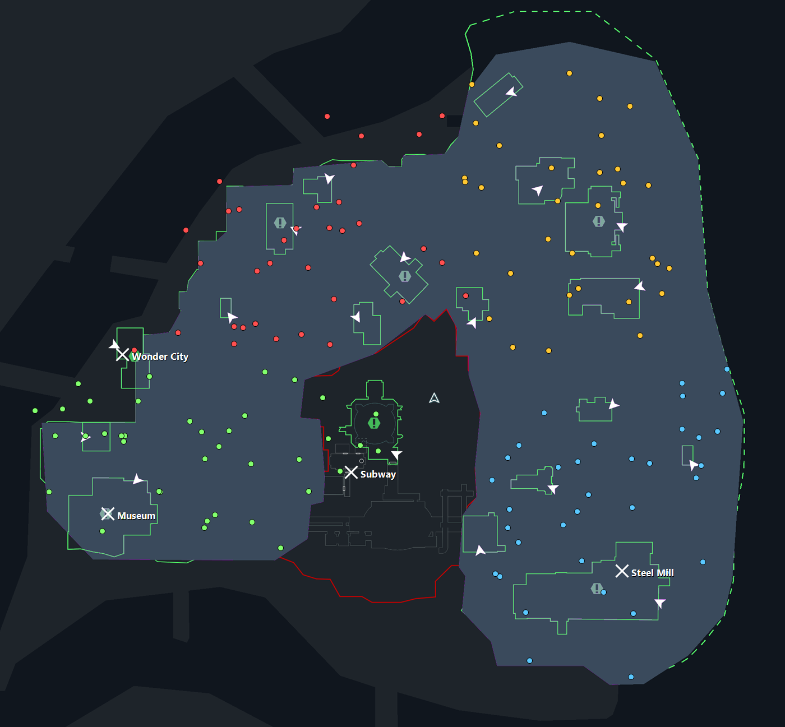

# Batman: Arkham City — Archipelago

An [Archipelago](https://archipelago.gg) multiworld randomizer for
**Batman: Arkham City (Game of the Year Edition)** on Steam.

Riddler Trophies become checks. Gadgets, Batsuit upgrades and the trophies
themselves become items — scattered across your multiworld, or someone
else's.



---

## ⚠️ Alpha

**This is alpha software.** The core loop works end to end — items arrive from
the multiworld, gadgets are granted and revoked, checks are sent, and the
PopTracker pack autotracks — but:

- **The logic is believed correct but is largely untested.** It was derived by
  reading a full trophy guide and cross-referencing in-game data. It has not
  been proven across many real multiworlds.
- **Some things are known missing.** See [Feature goals](#feature-goals).
- **Expect rough edges**, especially with `randomize_counter` enabled.

**Don't expect regular updates.** This is a hobby project and gets worked on
when there's time. Issues and reports are welcome, but please don't rely on a
fix arriving quickly.

---

## How it plays

The randomizer is framed as a **post-game**. You start from a supplied save
with the main story already complete, and Batman's gadgets are then stripped.

- **Checks** — 247 physical Riddler Trophies. Picking one up sends a check.
- **Items** — gadgets, 27 Batsuit/combat/gadget upgrades, and Riddler Trophies.
- **Goal** — receive a configurable number of Riddler Trophies (default 100).

The trophy you pick up isn't the trophy you receive. Physical pickups fire
checks; the trophies that count toward your goal arrive as items.

### Why a supplied save?

Riddler trophies sit behind puzzles, and puzzle state is saved separately
from pickup state. Resetting the pickups alone would leave trophies sitting
inside already-solved puzzles — not gameplay. Every run therefore starts from
the same prepared save, which also makes seeds reproducible between players.

---

## Installation

> **Windows only. Batman: Arkham City *Game of the Year Edition* only.**
> The non-GOTY build has a different executable and is not supported.

Download this repo, then **run `install.bat`**.

It prints everything it intends to do — every file it writes, every URL it
downloads from — and does nothing until you type `YES`. It will:

- find your game through Steam, and your saves even if Documents is
  redirected to OneDrive
- download and install [BmSDK](https://bmsdk.dev) from its official releases
  (asking separately before replacing `BatmanAC.exe`, backing yours up first)
- install the scripts, the apworld, the YAML template and the starting save

```powershell
.\install.ps1 -Check      # verify an existing install, change nothing
.\install.ps1 -DryRun     # show every action, change nothing
.\install.ps1 -SkipBmSDK  # you already have BmSDK working
```

**`-Check` is the first thing to run if something's wrong** — it reports what's
missing, and its output is what to paste into a bug report.

Prefer to do it by hand, or the installer can't find something? Full manual
steps are in **[docs/INSTALL.md](docs/INSTALL.md)**.

### What the installer will never do

It doesn't touch `Save0.sgd`, the registry, or anything outside your game
folder, Archipelago folder and save folder. It sends nothing anywhere and has
no telemetry. Its only network access is the two BmSDK release URLs it shows
you up front.

---

## Feature goals

Roughly in the order they're likely to happen. No timeline promised.

**Known gaps**
- [ ] The in-game Riddler counter still increments on pickup, so it drifts
      from the number of trophies you've actually received
- [ ] Logic needs validation across real multiworlds
- [ ] 4 Subway trophies (9, 10, 23, 24) have unconfirmed requirements and are
      marked as such in the tracker

**Planned**
- [ ] Traps as an item category
- [ ] Optional check categories: the 113 Riddles and 40 Physical Challenges
- [ ] Catwoman as a separate slot or check set
- [ ] Death Link
- [ ] Better in-game UI for what's been received

**Maybe**
- [ ] Randomized enemy encounters
- [ ] New Game+ as a start state
- [ ] Support for the Epic/GOG builds (currently Steam GOTY only)

---

## Credits

- **Archipelago** — the multiworld framework this is built on.
- **[BmSDK](https://bmsdk.dev)** (`Team-BmSDK/BmSDK-AC`, MIT) — the C# scripting SDK that
  makes any of this possible. Not bundled here; install it separately.
- **The starting save** comes from the Steam guide
  ["Save Files Compendium"](https://steamcommunity.com/sharedfiles/filedetails/?id=3173362158),
  which hosts a set of progressive Arkham City saves. The file used here is
  their main-story-complete save. All credit to that author for compiling and
  sharing them — it saved this project an enormous amount of work.
- **[GamesRadar's Riddler trophy guide](https://www.gamesradar.com/batman-arkham-city-riddler-guide/)**
  was read end to end to derive the gadget requirements behind the logic.
- **Claude (Anthropic)** provided substantial coding help throughout — the
  in-game C# bridge, the apworld, the tracker pack, and a lot of the
  reverse-engineering legwork.

### A note on the included assets

The PopTracker pack contains item icons and map art extracted from the game's
own files, and the repo includes a save file. These are only useful to someone
who already owns Batman: Arkham City — they do nothing on their own and are
not a substitute for the game. Batman: Arkham City is © Warner Bros.
Interactive Entertainment / Rocksteady Studios. This project is unaffiliated
and non-commercial.

If you own the rights to anything here and would like it removed, open an
issue and it will be.

---

## Development

`notes.md` is the project's running journal — design decisions, dead ends, and
the reverse-engineering chains behind the logic. It's long, unpolished, and by
far the most useful thing to read before changing anything.

Dev-only tools live in `dev/`. Note `dev/game_scripts_dev/UnlockTest.cs` binds
**G** to "give all gadgets" — handy for testing, ruinous in a real run, which
is why it isn't part of a normal install.
